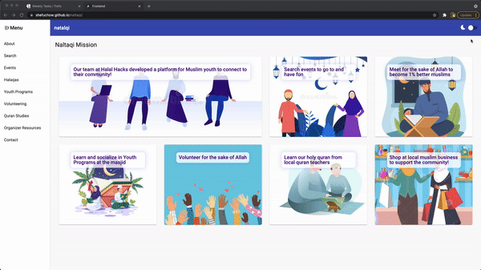

# Platform for Muslim Youth!
HalalHacks Web App to connect young muslims to their community, and enable them with learning, growing, social and volunteering opportunities  

<!-- Need to run ng build --prod --baseHref="https://shefuchow.github.io/naltaqi/" to update deployment -->
> [Web App now live, click here for demo](https://shefuchow.github.io/naltaqi/) 

<!-- To Do: Update this link -->
> [Devpost Submission](https://devpost.com/software/naltaqi?ref_content=my-projects-tab&ref_feature=my_projects) 

<!-- To Do: Update this link -->
> [HalalHacks Presenation Slides](https://drive.google.com/file/d/1ZSgBUYeO3xQtc_aKvF1jE-BpGWxIf4rk/view?usp=sharing)

> [Initial UX sketch made by our UX designer](https://devpost.com/software/naltaqi?ref_content=my-projects-tab&ref_feature=my_projects) 

._.

The software quality in this repo is non existent, it was the fastest way to organize a project that we could finish in one day (yes one day)  

if there was more time:  

- i'd utilize interfaces to have every other event-type inherit our i-event.ts interface  
- i'd only have one card component class to generate the list of event card results  
- i'd only have one component for the pages linked in the side bar. the title only changes, so we can take advantage of activated route or pass a variable of the title text. many better solutions  
- i can skip mentioniong "actually using a database" & having an Api project, ofc we can continously make this list longer.  
- but from the code thats exisiting, thats how i would architect things to improve the software quality.   
  

